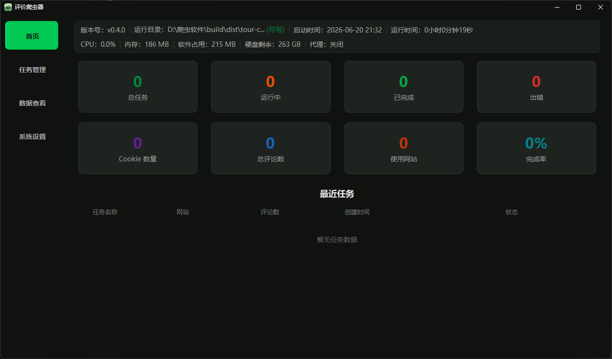

<h1 align="center">
  <br>
  <strong>🦀 评价爬虫器——旅游评论采集工具</strong>
  <br>
</h1>

<p align="center">
  <a href="LICENSE"></a>
  <a href="#"></a>
  <a href="#"></a>
  <a href="#"></a>
  <a href="#"></a>
  <a href="#"></a>
</p>

<p align="center">
  Languages:
  <a href="./README.md"> 简体中文 </a>
</p>

<p align="center">
  <strong> 支持携程、去哪儿、飞猪、大众点评四大旅游平台，一键爬取景区评论数据 </strong>
</p>

## 简介

&nbsp;&nbsp;&nbsp;&nbsp;&nbsp;&nbsp;&nbsp;&nbsp;评价爬虫器是一款基于 PySide6 构建的 Windows 桌面应用，专注于**旅游景区的用户评论数据采集**，软件采用**暗夜绿**暗色主题与**晨曦绿**浅色主题双皮肤，支持高 DPI 自适应，适配 720P ~ 4K 分辨率，提供三栏布局的现代化桌面交互界面。软件通过纯 HTTP 请求 + Selenium 浏览器渲染两种模式，覆盖携程、去哪儿、飞猪、大众点评四大平台的评论爬取（目前去哪儿和大众点评还在开发适配中）。内置 Cookie 管理、图片本地下载、多格式导出（TXT / CSV / XLSX / DOCX）和桌面通知推送，提供开箱即用的完整体验。

## 功能概览

| 功能 | 说明 |
|------|------|
| 🌐 多平台支持 | 携程、去哪儿、飞猪、大众点评，预设站点适配器 |
| 🍪 Cookie 管理 | 一键拉取系统浏览器（Edge / Chrome / Firefox）的登录 Cookie，按平台分类存储 |
| 🔐 验证码自动求解 | 基于 PIL/numpy 边缘检测的滑块验证码自动识别，人类轨迹模拟 |
| 🖼️ 图片下载 | 评论图片多线程下载到本地，DOCX 导出时自动嵌入 |
| 📤 多格式导出 | TXT · CSV · XLSX · DOCX，支持关键字过滤、图片过滤、纯表情过滤 |
| 🔔 任务通知 | 桌面弹窗 + 声音提示 + PushPlus 微信推送 |
| 🎨 双主题 | 暗夜绿（暗色）/ 晨曦绿（亮色）/ 跟随系统，窗口标题栏同步 |
| 🧵 异步爬取 | QThread + Signal/Slot，爬取不卡 UI，支持暂停/恢复/停止 |
| ⏸️ 断点续爬 | 任务进度自动保存，重启后可从中断位置继续 |
| 💻 Windows 专属 | 纯 Windows 10/11 64 位桌面应用，PyInstaller 打包分发 |

## 平台支持矩阵

| 平台 | 爬取模式 | 验证码处理 |
|------|----------|-----------|
| 携程 | requests（首页）+ Selenium 点击翻页（后续页） | — |
| 去哪儿 | — | — |
| 飞猪 | Selenium 滚动加载 | 滑块自动求解 |
| 大众点评 | — | — |

## 系统要求

| 项目 | 最低要求 |
|------|---------|
| 操作系统 | Windows 10 版本 1809 及以上 / Windows 11 |
| 架构 | 64 位（x64） |
| 内存 | 建议 4GB 及以上 |
| 浏览器 | Edge / Chrome / Firefox（仅 Cookie 获取时需要） |

## 快速开始

### 下载 & 运行（普通用户）

1. 从 [Releases](../../releases) 页面下载最新版 `TravelReviewCrawler-v0.4.1-win10-win11-x64.7z`
2. 解压到任意目录（**不要放在需要管理员权限的目录**，如 `C:\Program Files`）
3. 双击 `tour-crawler.exe` 启动

> 首次启动会自动创建 `cookies/`、`logs/`、`exports/`、`tasks/` 等运行时文件夹。

### 从源码运行（开发者）

```bash
# 环境要求：Python 3.13+
git clone https://github.com/MqKeYan/travel-review-crawler.git
cd travel-review-crawler
pip install -r requirements.txt --upgrade
cd src && python main.py
```

### 打包为 exe

```bash
cd travel-review-crawler
python -m PyInstaller tour-crawler.spec
# 输出目录：build/dist/tour-crawler/
```

## 界面截图

| 暗夜绿（暗色主题） | 晨曦绿（浅色主题） |
|:---:|:---:|
|  |  |

## 使用流程

1. **获取 Cookie**：首页点击「获取 Cookie」，选择目标平台，软件自动打开系统浏览器到登录页，登录后自动提取
2. **新建任务**：选择爬取网站、输入目标 URL（或景点 ID）、设置爬取条数和页数、选择过滤规则
3. **启动爬取**：任务列表点击「开始」，实时查看进度和速度
4. **数据导出**：切换到数据页面，选择任务，导出为 TXT / CSV / XLSX / DOCX

## 项目结构

```
travel-review-crawler/
│
├── src/                                # 源代码根目录
│   ├── main.py                         # 应用入口，初始化 QApplication、主题、托盘
│   ├── __init__.py                     # 版本号
│   │
│   ├── engine/                         # 爬虫核心引擎
│   │   ├── crawler.py                  # 通用爬虫引擎：分页、重试、UA 伪装、Cookie 注入
│   │   ├── cookie_manager.py           # Cookie 管理：拉取系统浏览器本地 Cookie 数据库
│   │   ├── captcha_solver.py           # 滑块验证码自动求解：Canny 边缘检测 + 人类轨迹模拟
│   │   ├── image_downloader.py         # 评论图片批量下载：多线程并发、自动重试
│   │   ├── ua_spoofer.py               # User-Agent 随机伪装池
│   │   └── notifier.py                 # 桌面通知 + PushPlus 微信推送
│   │
│   ├── sites/                          # 网站适配器（策略模式）
│   │   ├── base.py                     # 抽象基类 SiteAdapter，定义统一接口
│   │   ├── ctrip.py                    # 携程适配器：requests 翻页解析
│   │   ├── qunar.py                    # 去哪儿适配器：requests 翻页 + Selenium 兜底
│   │   ├── fliggy.py                   # 飞猪适配器：Selenium 滚动加载 + 验证码求解
│   │   ├── dianping.py                 # 大众点评适配器：Selenium 翻页 + CSS/SVG 字体解密
│   │   └── __init__.py                 # 适配器注册表 get_site_adapter()
│   │
│   ├── ui/                             # PySide6 桌面界面层
│   │   ├── main_window.py              # 暗夜绿三栏主窗口 + QSystemTrayIcon 系统托盘
│   │   │
│   │   ├── pages/                      # 页面模块（QStackedWidget 子页面）
│   │   │   ├── home_page.py            # 首页仪表盘：系统信息栏 + 统计卡片 + 最近任务
│   │   │   ├── task_page.py            # 任务管理：任务列表 + 操作按钮（开始/暂停/停止/删除）
│   │   │   ├── create_task_page.py     # 新建任务：站点选择、URL 输入、参数配置、Cookie 获取
│   │   │   ├── data_page.py            # 数据查看与导出：表格浏览 + 格式选择
│   │   │   └── settings_page.py        # 系统设置：主题切换、代理、导出路径、任务默认值
│   │   │
│   │   ├── components/                 # 可复用 UI 组件
│   │   │   ├── sidebar.py              # 侧边栏导航（首页 / 任务 / 数据 / 设置）
│   │   │   ├── task_card.py            # 任务卡片：进度条 + 状态标签 + 操作按钮
│   │   │   ├── progress_bar.py         # 爬取进度条：百分比 + 速度 + ETA
│   │   │   ├── data_table.py           # 数据表格：QAbstractTableModel + 排序 + 分页
│   │   │   └── cookie_dialog.py        # Cookie 获取对话框：打开浏览器 → 登录 → 提取
│   │   │
│   │   └── theme/                      # 主题引擎
│   │       └── dark_forest_theme.py    # 暗夜绿 + 晨曦绿双主题 QSS + Windows DWM 标题栏同步
│   │
│   ├── services/                       # 业务逻辑服务层（单例模式）
│   │   ├── task_service.py             # 任务生命周期管理：创建/启动/暂停/恢复/停止/删除
│   │   ├── data_service.py             # 评论数据存储与查询，未导出数据追踪
│   │   ├── cookie_service.py           # Cookie 提取/保存/加载/清除，按平台隔离
│   │   ├── export_service.py           # 导出调度：同步/异步导出，QThread 异步不卡 UI
│   │   ├── system_service.py           # 系统设置读写，Windows 主题注册表检测
│   │   ├── site_service.py             # 站点列表查询，URL 自动识别与模板拼接
│   │   ├── stats_service.py            # 运行统计：使用时长、完成任务数
│   │   └── __init__.py                 # 服务层统一导出
│   │
│   ├── workers/                        # QThread 异步工作线程
│   │   ├── crawl_worker.py             # 爬取工作线程：QThread + Signal 实时推送进度
│   │   ├── export_worker.py            # 导出工作线程：大数据量异步导出
│   │   └── __init__.py
│   │
│   ├── filters/                        # 评论内容过滤器链
│   │   ├── base.py                     # 过滤器抽象基类 + FilterChain 责任链
│   │   ├── keyword_filter.py           # 敏感词 / 广告关键词过滤
│   │   ├── image_filter.py             # 去除图片评论 / 仅保留含图评论
│   │   ├── emoji_filter.py             # 去除 emoji 表情符号
│   │   ├── pure_emoji.py               # 纯表情评论过滤
│   │   └── __init__.py                 # build_filter_chain() 工厂函数
│   │
│   ├── export/                         # 多格式导出器（策略模式）
│   │   ├── base.py                     # 导出器抽象基类 BaseExporter
│   │   ├── txt_exporter.py             # 纯文本导出
│   │   ├── csv_exporter.py             # CSV 表格导出
│   │   ├── xlsx_exporter.py            # Excel (.xlsx) 导出，openpyxl
│   │   ├── docx_exporter.py            # Word (.docx) 导出，内嵌图片自动缩放
│   │   └── __init__.py
│   │
│   ├── models/                         # 数据模型
│   │   ├── task.py                     # Task / TaskConfig / TaskStatus 定义
│   │   ├── review.py                   # 评论数据结构 + 标准化字段
│   │   └── __init__.py
│   │
│   ├── utils/                          # 工具模块
│   │   ├── paths.py                    # 运行目录管理：exe 目录 vs %APPDATA% 自适应
│   │   ├── logger.py                   # 日志系统：按日切割 + 自动清理过期日志
│   │   ├── exceptions.py               # 自定义异常：NetworkError / ParseError / RateLimitError 等
│   │   └── __init__.py
│   │
│   └── assets/                         # 静态资源
│       └── app.ico                     # 软件图标（嵌入 exe + 托盘显示）
│
├── tests/                              # 测试套件
│   ├── test_all_backend.py             # 后端逻辑测试：适配器、过滤器、导出器
│   └── test_gui_smoke.py               # GUI 冒烟测试
│
├── build/                              # 打包目录
│   └── dist/tour-crawler/              # PyInstaller 打包最终产物（--onedir 模式）
│
├── tour-crawler.spec                   # PyInstaller 规格文件
├── requirements.txt                    # Python 依赖清单（pip install -r）
├── CHANGELOG.md                        # 版本更新日志
├── RELEASE.md                          # GitHub Release 发布说明模板
└── LICENSE                             # GPL-3.0 开源许可证
```

## 讨论与交流

&nbsp;&nbsp;&nbsp;&nbsp;&nbsp;&nbsp;&nbsp;&nbsp;如果你在使用过程中遇到任何问题，或者有新的功能需求、改进建议，欢迎在 [GitHub Issues](../../issues) 中提出。如果你有相应的解决方法，也非常欢迎提交 Pull Request 帮助我一起完善这个项目！

## 行为准则

&nbsp;&nbsp;&nbsp;&nbsp;&nbsp;&nbsp;&nbsp;&nbsp;本项目遵循 **Contributor Covenant Code of Conduct**。我们致力于营造一个开放、友好、互相尊重的社区环境。

## 许可证

&nbsp;&nbsp;&nbsp;&nbsp;&nbsp;&nbsp;&nbsp;&nbsp;本项目采用 **GPL-3.0 License** 开源许可证。详见 [LICENSE](./LICENSE) 文件。
